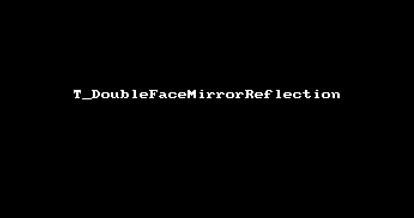

## T_DoubleFaceMirrorReflection 双面镜面反射

### Github
[https://github.com/l2xin/ZT_ShaderLearning/tree/master/Assets/L2xin/002_DoubleFaceMirrorReflection](https://github.com/l2xin/ZT_ShaderLearning/tree/master/Assets/L2xin/002_DoubleFaceMirrorReflection)


### 效果如下：



---
### Cull Off
需关闭裁剪背面剔除或者正面剔除。

---
### 法线方向和光源方向dot计算出镜面反射结果
``` GLSL
o.diffuseFront = max(0, dot( UnityObjectToWorldNormal(v.normal), _WorldSpaceLightPos0.xyz));
o.diffuseBack = max(0, dot( -UnityObjectToWorldNormal(v.normal), _WorldSpaceLightPos0.xyz));
```

---
### VFACE：被渲染的面是否朝向摄像机，
用于片段着色器，需要添加`#pragma target 3.0`编译指令。

用法如下：

```GLSL
fixed4 frag (fixed facing : VFACE) : SV_Target
{
    return facing > 0 ? _ColorFront : _ColorBack;
}
```


---
## 其他

* 使用**max**(0, _diffuceColor)：dot计算可能出负数，颜色为负不合法。
* **_WorldSpaceLightPos0** ：内置变量，获得光照方向。
* 使用`facing > 0 ? _ColorFront : _ColorBack`三目运算符而非`if else`，切记。 
* 上一级目录下 builtin_shaders-2018.2.11f1/UnityShaderVariables中包含一些内置变量，放在这里方便查看。

---
## 参考

* [内置变量参考https://docs.unity3d.com/462/Documentation/Manual/SL-BuiltinValues.html](https://docs.unity3d.com/462/Documentation/Manual/SL-BuiltinValues.html)
