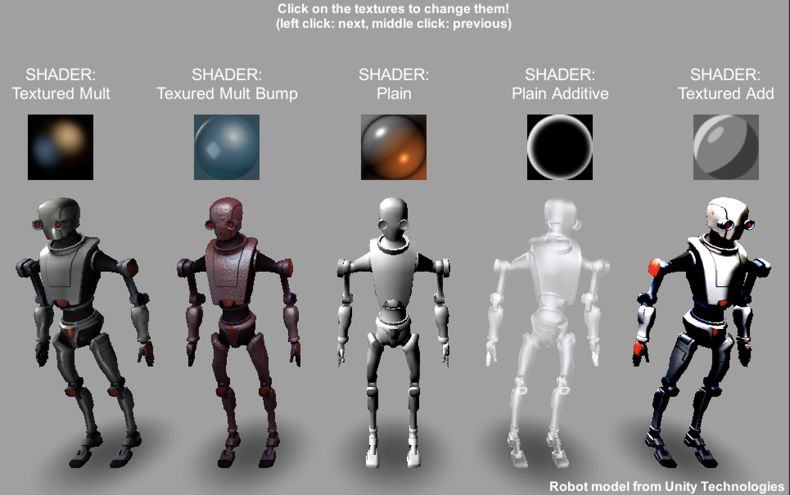
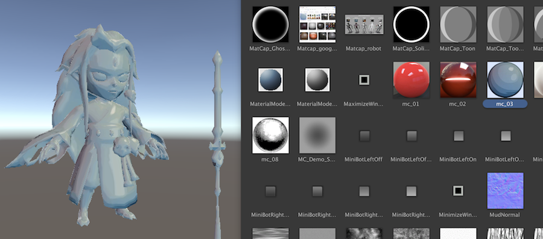
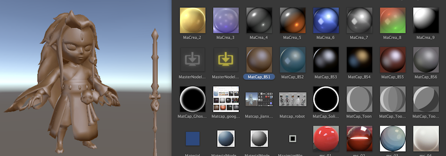
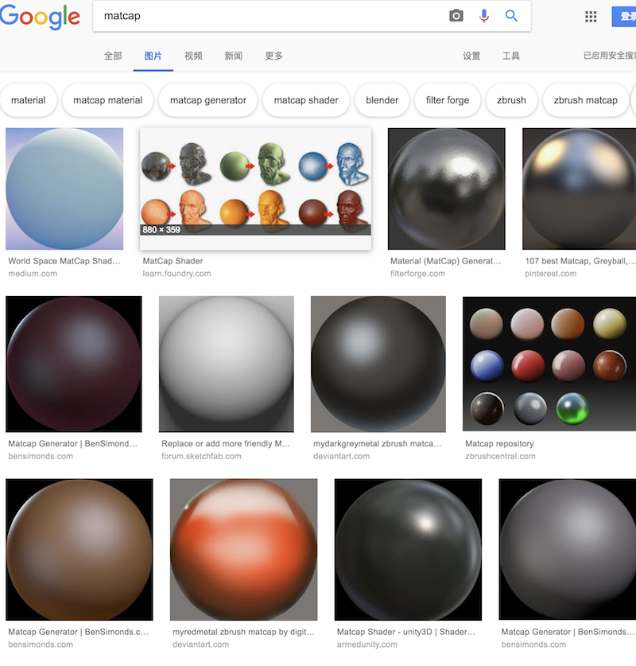

## T_MatcapBaseShader

## Github
[https://github.com/l2xin/ZT_ShaderLearning/tree/master/Assets/L2xin/005_MatcapBase](https://github.com/l2xin/ZT_ShaderLearning/tree/master/Assets/L2xin/005_MatcapBase)

----
## Mapcap是什么

[Unity Community Wiki](http://wiki.unity3d.com/index.php/MatCap)上的定义：
> MatCap (Material Capture) shader, for displaying objects with reflective materials with uniform surface colouring, like Zbrush or Mudbox can. It uses an image of a sphere as a view-space environment map. It's very cheap, and looks great when the camera doesn't rotate.

qianmo的文章：
> MatCap Shader的基本思路是，使用某特定材质球的贴图，作为当前材质的视图空间环境贴图（view-space environment map），来实现具有均匀表面着色的反射材质物体的显示。考虑到物体的所有法线的投影的范围在x(-1,1),y(-1,1),构成了一个圆形，所以MatCap 贴图中存储光照信息的区域是一个圆形。基于MatCap思想的Shader，可以无需提供任何光照，只需提供一张或多张合适的MatCap贴图作为光照结果的“指导”即可。

以下图片来自AssetStore中该资源：

* [https://assetstore.unity.com/packages/vfx/shaders/free-matcap-shaders-8221](https://assetstore.unity.com/packages/vfx/shaders/free-matcap-shaders-8221)


----------

## 效果gif
* AssetStore中资源展示：


* 自己做的：



<br>


-----
## Matcap优缺点

#### 优点
运算效率极高，计算成本极低，在很多场合却能够替代PBR。用Unlit级别的计算成本，获得3A级的渲染效果。

简单情况：只需简单更换Matcap贴图就能实现各种神奇的渲染效果。

复杂模型：可以通过几张简单的Matcap贴图组合来实现模型上各部位细节差异。

#### 缺点
Matcap无法响应光源与相机位置的变化，原因很简单——Matcap采样贴图是静态的，通过相机空间映射的


-----
## Matcap贴图获取
一般可以在Zbrush/MarmosetToolbag等软件中自己制作。

也可以在网上直接下载一些别人制作好的（[pinterest.com](https://www.pinterest.com/)有非常多）:




----------
## Shaderlab实现

``` GLSL
v2f vert (a2v v)
{
    v2f o;
    o.uv = TRANSFORM_TEX(v.uv, _MainTex);
    o.viewNormal = mul(UNITY_MATRIX_IT_MV, v.normal);
    return o;
}

fixed4 frag (v2f i) : SV_Target
{
    fixed4 col = tex2D(_MainTex, i.uv);
    fixed4 matcapColor = tex2D(_MatcapTex, i.viewNormal.xy* 0.5 + 0.5);
    return col * matcapColor;
}
```


-------
## UNITY_MATRIX_IT_MV

把normal转换到view视图以获得一个(-1,1)区间的数值：
```
o.viewNormal = mul(UNITY_MATRIX_IT_MV, v.normal);
```

首先，看一下Unity Doc中的描述：

||||
|-|-|-|
UNITY_MATRIX_IT_MV	|float4x4	|Inverse transpose of model * view matrix.

然后我们来看一下UNITY_MATRIX_IT_MV实际的变换意义：

The transpose of World2Object is the transpose of the inverse of the Object2World matrix.
* MV transforms points from object to eye space
* IT_MV rotates normals from object to eye space
  
And similarly:
* Object2World transforms points from object to world space
* IT_Object2World (which, as you point out, is the transpose of World2Object) rotates normals from object to world space

If it is orthogonal, the upper-left 3x3 of Object2World will be equal to that of IT_Object2World, and so will also rotate normals from object to world space.

之所以法线不能直接使用UNITY_MATRIX_MV进行变换，是因为法线是向量，具有方向，在进行空间变换的时候，如果发生非等比缩放，方向会发生偏移。我们可以简单的把法线和切线当成三角形的两条边，显然，三角形在空间变换的时候，不管是平移，还是旋转，或者是等比缩放，都不会变形，但是如果非等比缩放，就会发生拉伸。所以法线和切线的夹角也就会发生变化。（而切线在变换前后，方向总是正确的，所以法线方向就不正确了）。


### **结论**：
对顶点变化Wolrd2View使用MV矩阵，对normal变换使用IT_MV矩阵。

### **公式**：

* 顶点变换矩阵：$\vec{M}$ 

* 法向量变换矩阵： $\vec{G}$ = $({\vec{M}^{-1}})^{T}$ 

### **详细推导过程**：
[Normal_Matrix推导说明.md](Normal_Matrix推导说明.md)

-----

## 其他

如何利用Matcap实现pbr效果还没看，后面和TA交流请教一下。

-------------

## 参考

* [http://wiki.unity3d.com/index.php/MatCap](http://wiki.unity3d.com/index.php/MatCap)

* [UNITY_MATRIX_IT_MV - SL-UnityShaderVariables.html](https://docs.unity3d.com/Manual/SL-UnityShaderVariables.html) 
  
* [http://www.lighthouse3d.com/tutorials/glsl-12-tutorial/the-normal-matrix/](http://www.lighthouse3d.com/tutorials/glsl-12-tutorial/the-normal-matrix/)
  
* [图形程序/技术美术 Shading Artist -https://zhuanlan.zhihu.com/p/37702186](https://zhuanlan.zhihu.com/p/37702186)

* [【Unity Shader编程】之十六 基于MatCap实现适于移动平台的“次时代”车漆Shader](https://blog.csdn.net/poem_qianmo/article/details/55803629)
